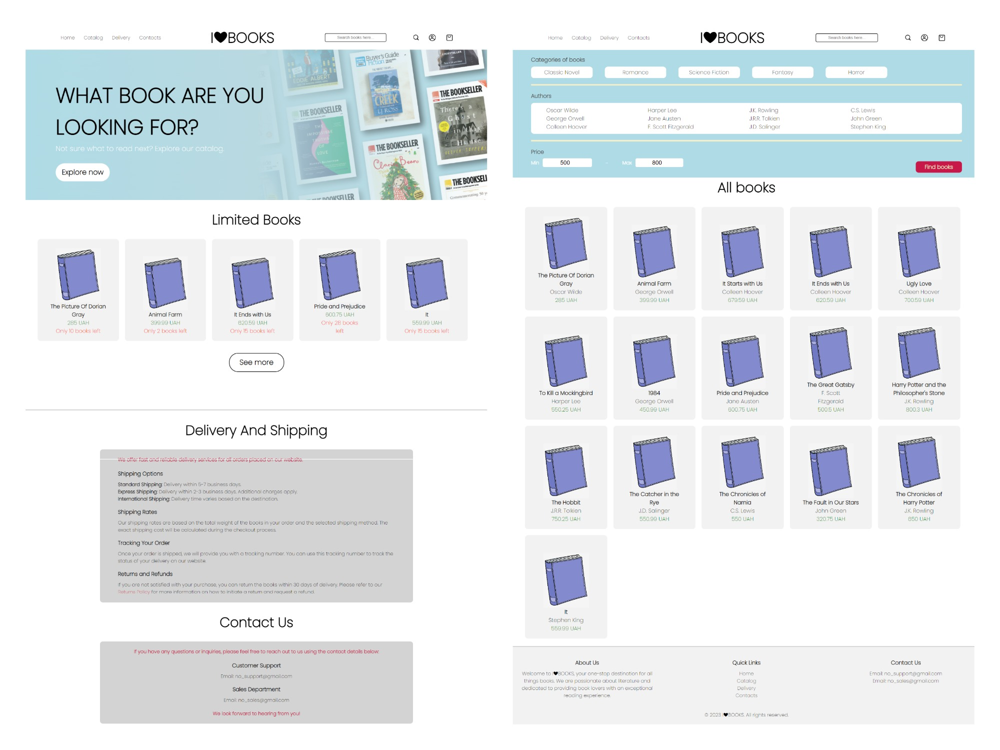

# I&#10084;BOOKS - ONLINE BOOKSTORE
Our online bookstore project is a web application that allows users to browse and purchase books online. 
<br/>
***It was created by our team - Anastasiia Sanina, Liubov Rekechynska, Yulia Lehenka and Maryna Vasylieva.***


# Preview



# Main features for users:

- Search books by name 
- Filter books by price, genre and author
- Filter books by amount in stock
- Add chosen books to a cart
- Authorization

# Installation and Usage:
1. Install Node JS

2. Clone the repository with the following command:
```bash
$ git clone https://github.com/anastasiiasanina/E-commerce-Bookstore.git
```

3. Run the server with the following commands:
```bash
$ cd .\backend\
$ nodemon .\server.js
```

4. Open http://localhost:8000/home to see the home page of our website.
